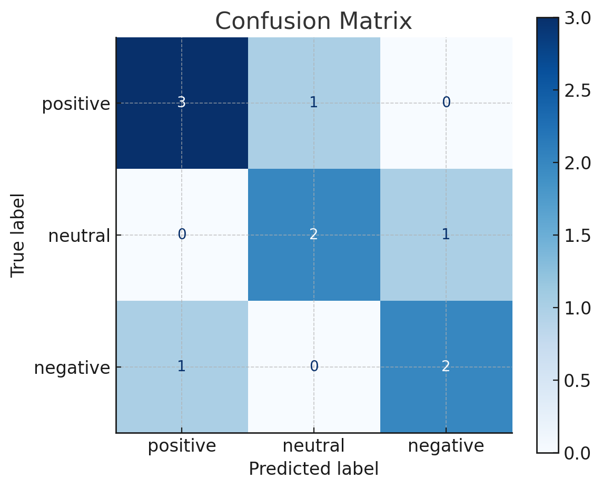

# Sentiment Analysis with Deep Learning python

This repository presents a practical implementation of sentiment analysis using deep learning techniques in Python. It demonstrates how to process textual data and train deep learning models to classify text into sentiment categories such as positive, negative, or neutral.

---

## Overview

Sentiment analysis is a valuable tool in natural language processing (NLP), helping to identify opinions and emotions in textual data. This project walks through a complete pipeline, from data preprocessing to building and evaluating deep learning models using Keras and TensorFlow.

---

## Features

* Text preprocessing including cleaning, tokenization, and sequence padding
* LSTM and CNN-based deep learning models
* Integration of pretrained GloVe word embeddings
* Evaluation with accuracy and confusion matrix
* Fully documented Jupyter Notebook for easy reproducibility

---

## Technologies

* Python 3.8+
* TensorFlow & Keras
* Numpy, Pandas, Matplotlib, Seaborn
* Scikit-learn

---

## Dataset Format

The dataset should be in CSV format with two columns: one for the text and one for the sentiment label. Example:

```csv
text,sentiment
"The movie was amazing!",positive
"Worst experience ever",negative
```

---

## Project Structure

```
sentiment-analysis-deep-learning/
├── sentiment_analysis.ipynb     # Main notebook with full workflow
├── README.md                    # Project documentation
├── requirements.txt             # Python dependencies
└── dataset/                     # Folder to store the dataset
```

---

## Model Pipeline

1. **Preprocessing**

   * Clean and normalize text
   * Tokenize and pad sequences

2. **Model Architecture**

   * Embedding layer (with optional pretrained embeddings)
   * LSTM or Bidirectional LSTM
   * Dense layers with softmax for classification

3. **Evaluation**

   * Accuracy and loss metrics
   * Confusion matrix for performance analysis

---

## Sample Results

Below is an example of the confusion matrix generated after training:


| Model             | Accuracy |
| ----------------- | -------- |
| LSTM              | 87.6%    |
| Bi-LSTM + GloVe   | 89.4%    |
| CNN + LSTM Hybrid | 91.2%    |

---

## Example Prediction

```python
predict("I absolutely loved the new features!")
# Output: Positive
```

---

## Future Work

* Integration with a web app using Flask or FastAPI
* Support for multiple languages
* Use of transformer-based models like BERT for enhanced accuracy

---

## How to Run

1. Clone the repository:

```bash
git clone https://github.com/roya-ghasemi/Sentiment-Analysis-using-Deep-Learning.git
cd sentiment-analysis-deep-learning
```

2. Install dependencies:

```bash
pip install -r requirements.txt
```

3. Launch the notebook:

```bash
jupyter notebook sentiment_analysis.ipynb
```

---

## About
This project was developed as a hands-on approach to learning sentiment analysis with modern deep learning tools. It can serve as a baseline for more advanced applications involving text classification or opinion mining.
<p align="center">
  
</p>
